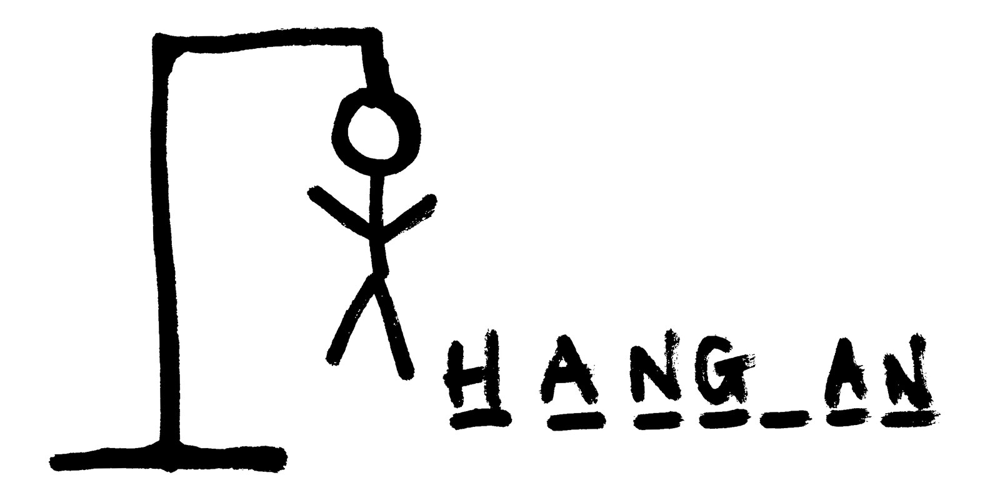

# mini-project : Hangman

Traditionally, Hangman was a paper and pencil guessing game for two or more players. **One player thinks of a word, phrase or sentence and the other(s) tries to guess it** by suggesting letters. Having a maximum of 6 lives ( head, torso, 2 arms and 2 legs).

## Instructions to play:

1. For this game I have chosen flowers as the theme, therefore I have written down on a list,**10 different types of flowers** for the user to guess.
2. One word from the list will be chosen randomly and the player must guess it by choosing one letter at a time.
2. On the initial screen the user will see:
    * A display of the letters the user has already used
    * A drawing of the hangman
    * The lives the user has left
    * Dashes for the current word the user is trying to guess
    * And the option to give an input (a letter to start the game)

3. To start playing, the user must type a letter.
4. **If the letter is included in the chosen word**, the dash will be substituted by the letter.
5. **If the letter is not included**, the lives will go down by 1, the drawing of the hangman will add one part of the body and no dash from the word will be removed.
6. The game ends once the word has been guessed completely or there are no lives left.
7. If this happens, the computer will give you the option to start again a new game.

